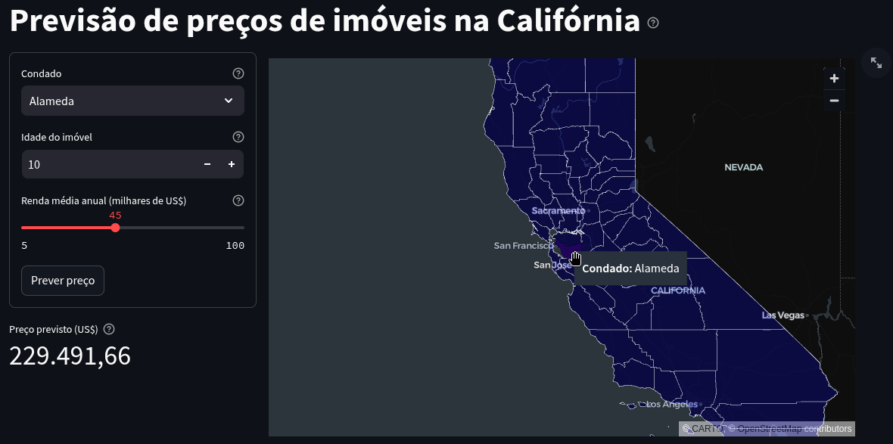

# Projeto: Previsão de Preços de Imóveis

**Descrição:** Projeto de ciência de dados com previsão de preços de imóveis na Califórnia. Os dados utilizados no treinamento da regressão são de 1990 e não devem ser utilizados para fins comerciais nos tempos atuais. Além disso, a interface propositalmente ignora o tamanho do imóvel (os dados estão agrupados por bloco e usa totalização de cômodos), que seria relevante para sua avaliação.

**Autor:** Ivan Luís Duarte

**LinkedIn:** [linkedin.com/in/ivanluisduarte](https://www.linkedin.com/in/ivanluisduarte/ "https://www.linkedin.com/in/ivanluisduarte/")

**GitHub:** [github.com/ivanluisduarte](https://github.com/ivanluisduarte "https://github.com/ivanluisduarte")

**Data de Criação:** 2025-03-10

**Licença:** MIT

**Aplicação** [Previsão de Preços de Imóveis](https://california.streamlit.app "https://california.streamlit.app")




A aplicação está publicada em um ambiente gratuito da [Streamlit](https://streamlit.io/ "https://streamlit.io/") e "dorme" quando passa um tempo sem uso. Nesse caso, clique no botão azul da imagem abaixo e "acorde" a aplicação (isso pode levar dezenas de segundos para concluir):

 para acordar a aplicação")

# Sobre este projeto de ciência de dados

Baseado no modelo de [Francisco Bustamante](https://github.com/chicolucio/modelo_projeto_data_science "https://github.com/chicolucio/modelo_projeto_data_science"), que foi meu instrutor na base desse trabalho, no treinamento de regressão linear do curso de ciência de dados da Hashtag Treinamentos.

Apesar da idéia inicial ser do curso da Hashtag Treinamentos, todas as decições sobre features, algorítmos e escolha de modelos foi refeita, melhorada e comentada. Um modelo com mais features foi usado ao final. A preparação dos dados para o mapa da interface web e a construção dele ficou mais simples e direta.

Muitas funções foram criadas por mim, tornando esse projeto praticamente um framework para novos projetos de regressão. Uma sequencia clara de uso das funções deixa a construção de pipelines, treinamento e análise de modelos de regressão rápida e intuitiva.

# Conceitos e observações

- Bloco é uma área geográfica que agrupa residências, pode ser um quarteirão, um bairro ou até uma região inteira, dependendo da densidade populacional. Nossos dados geográficos não estão detalhados por esses blocos, mas sim por condado;
- Condado por sua vez, é uma região geográfica que agrupa cidades e são subdivisões dos estados, com certa autonomia administrativa, o que simplifica a interface para interação com o usuário e previsão de preços de casas nesses condado;
- Alguns dados, são pedidos na interface para detalhar o imóvel e renda, mas para alcançar essa simplificação, utilizamos a mediana e as modas dos dados de todos os blocos contidos naquele condado.
- Mediana para tentar evitar interferência de outliers. Alguns condados, se observado no mapa, são rurais ou desérticos e sua população acaba se concentando em pontos específicos, com pequenos grupos dispersos que seriam outliers;

## Importante

Leia o arquivo de [01_dicionario_de_dados.md](./referencias/01_dicionario_de_dados.md) para detalhes sobre a base.

## Organização do projeto

```
├── .gitignore         <- Arquivos e diretórios a serem ignorados pelo Git
├── ambiente.yml       <- O arquivo de requisitos para reproduzir o ambiente de análise
├── app.py             <- Aplicação com a interface WEB para uso do modelo via streamlit
├── requirements.txt   <- O arquivo de requisitos para o app no streamlit
├── LICENSE            <- Licença de código aberto (MIT)
├── README.md          <- README principal para desenvolvedores e recrutadores.
|
├── dados              <- Arquivos de dados para o projeto.
|
├── imagens            <- Arquivos de imagens do projeto.
|
├── modelos            <- Modelos treinados e serializados, previsões de modelos ou resumos de modelos
|
├── notebooks          <- Cadernos Jupyter. A convenção de nomenclatura é um número (para ordenação)
|   └──01-ild-eda.ipynb     <- Análise exploratória de dados sobre os dados do censo de 1990 agrupados por blocos
|   ├── 02-ild-model_etp1.ipynb   <- Analisa as bases criadas na análise exploratória para escolher entre a base com alguns outliers ou a base limpa
|   ├── 02-ild-model_etp2.ipynb   <- Analisa da base escolhida para determinar qual transformação de target deve ser utilizada para a modelagem
|   ├── 02-ild-model_etp3.ipynb   <- Analisa opções de transformação de features para escolher a melhor para cada coluna
|   ├── 02-ild-model_etp4.ipynb   <- Analisa opções de features polinomiais para alcançar um melhor modelo
|   ├── 02-ild-model_etp5.ipynb   <- Analisa opções de regularização das features polinomiais para tentar melhorar o modelo encontrado
|   ├── 02-ild-model_etp6.ipynb   <- Especializa a regularização das features polinomiais para tentar melhorar o modelo encontrado
|   ├── 02-ild-model_etp7_treinamento_final.ipynb   <- Treina o modelo com os melhores hiperparâmetros encotrados e salva para uso na aplicação
|   ├── 03-ild-geodata.ipynb   <- Prepara dados para a aplicação WEB de previsão, cruzandos dados geográficos e sumarizando por condado, para facilitar o uso e entendimento
|   └──src             <- Código-fonte para uso neste projeto.
|      │
|      ├── __init__.py   <- Torna um módulo Python
|      └── auxiliares.py <- Scripts de funções auxiliares que não são de gráficos e nem de modelos.
|      ├── config.py     <- Configurações básicas do projeto como pastas, arquivos e semente para replicar resultados.
|      └── graficos.py   <- Scripts para criar visualizações exploratórias e orientadas a resultados.
|      └── models.py     <- Scripts para treinamento de modelos e avaliação de resultados.
|
└── referencias        <- Dicionários de dados, manuais e todos os outros materiais explicativos.
```
